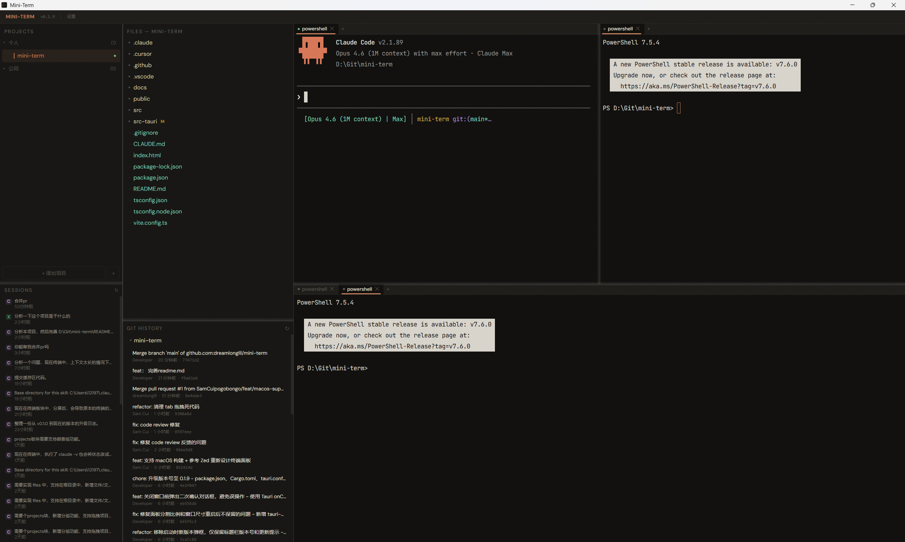
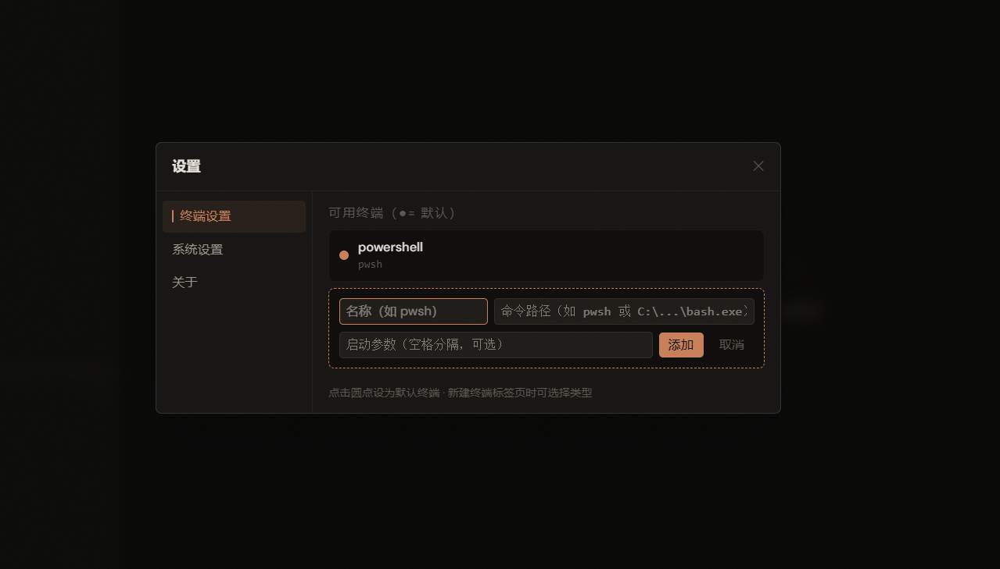
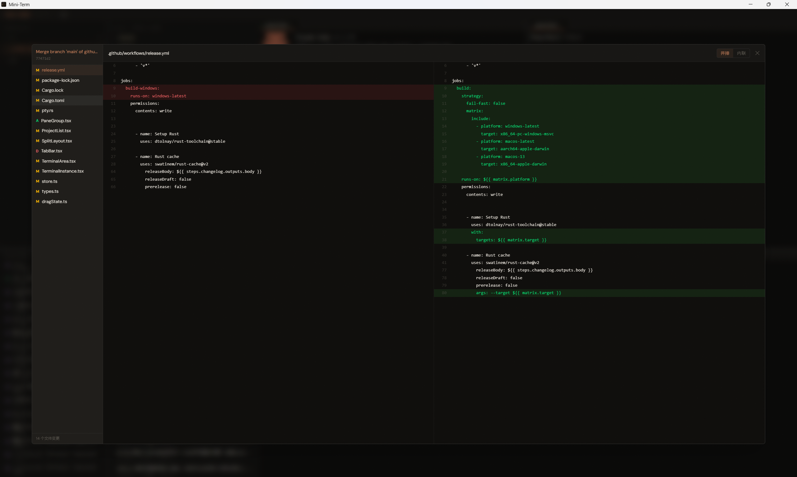

<p align="center">
  
</p>

<h1 align="center">Mini-Term</h1>

<p align="center">
  <strong>面向本地多工作区协作的桌面终端工作台 + MCP 控制面</strong><br>
  Tauri v2 · React 19 · Rust · Tracked Tasks · Approvals · Git Review
</p>

<p align="center">

  
  
  
  
  
</p>

---

## 项目定位

Mini-Term 不是单纯的桌面终端管理器，也不是一个孤立的 MCP server。

当前定位是：

- 本地多工作区桌面工作台
- 终端与 Git / 文件 / Workspace 上下文宿主
- Agent 任务工作台
- MCP 控制面
- 运行时 Prompt / Skill 策略注入中心

它一方面托管本地 `codex` / `claude` 任务，另一方面向外暴露稳定的 MCP 接口，供外部 Agent 或 MCP client 使用。

## 核心能力

### 桌面工作台

- 多工作区管理
- 多标签与递归分屏终端
- 文件树与 Git 状态感知
- AI session 历史读取
- Git diff / commit history 浏览

### 终端增强

- **多标签管理** — 每个项目独立标签页，拖拽排序，状态图标一目了然
- **递归分屏** — 横向 / 纵向任意嵌套分屏，Allotment 拖拽调整比例
- **高性能渲染** — xterm.js v6 + WebGL 加速，自动降级为 Canvas
- **10 万行滚动缓冲** — 拦截 CSI 3J（ED3）指令，Claude / Codex 等 TUI 清屏时保留上滚历史
- **终端缓存** — 切换标签 / 分屏不重建 xterm 实例，已有内容不丢失
- **复制粘贴** — `Ctrl+Shift+C` / `Ctrl+Shift+V` 快捷键 + 右键菜单，未选中时"复制"自动置灰；Windows 大段多行粘贴自动分块写入，防止 ConPTY 丢行
- **长文本粘贴** — 剪贴板文本 ≥10 行或 ≥2000 字符时自动转存为临时 `.txt` 并粘贴带引号的文件路径，避免 AI 工具直接处理超长内容引发性能与 paste bracket 问题
- **图片粘贴** — 剪贴板含截图时自动检测，通过 Win32 API 保存为临时 PNG 并粘贴带引号的路径，兼容 PinPix 等非标准格式
- **文件拖拽** — 文件拖到终端自动插入带引号的绝对路径，兼容含空格的路径
- **多 Shell 配置** — Windows（cmd / powershell / pwsh）、macOS（zsh / bash）、Linux（bash / sh）等，可自由增删
- **实时状态检测** — 500ms 轮询子进程名，自动识别 Claude / Codex，显示 idle / working / error 状态
- **状态聚合** — 面板 → 标签页 → 项目逐层聚合，优先级 `error > ai-working > ai-idle > idle`
- **完成提醒三件套** — AI 任务从 working → idle 时立刻触发：
  - 右下角 Toast 桌面通知（仅非活跃项目弹出，同项目去重）
  - 项目列表 DONE 徽章，点击清除
  - 任务栏闪烁（Windows）/ Dock 跳动（macOS），窗口失焦时才触发
  - 三个开关独立可配
- **会话进出检测** — 命令 echo 识别进入 AI；双击 `Ctrl+C` / `Ctrl+D` 或 `exit` / `quit` / `:quit` / `/logout` 识别退出
- **会话历史** — 读取本地 Claude / Codex 历史会话记录，右键复制恢复命令快速续接

### Agent 任务工作台

- 启动并跟踪 `codex` / `claude` 任务
- 展示任务状态、attention、输出摘要、变更文件
- 支持补充输入、恢复会话、关闭任务
- 提供独立任务面板标签页
- 提供 `AgentInbox` 作为审批和高优先任务入口

### MCP Runtime

- 本地 stdio / HTTP MCP server
- 运行时观测、PTY 控制、UI 控制、任务管理、兼容层工具
- 工作区边界校验
- 审批门控
- 任务状态与 review attention 持久化

### Prompt / Skill 策略层

- `codex` / `claude` / `cursor` / `generic-mcp` 四类 profile
- 分层 Prompt 体系
- 任务启动时自动注入运行时策略
- 设置页可编辑、预览、导出、逐层重置

## MCP 工具分组

当前 MCP 工具固定为 6 个 group、37 个工具：

- `core-runtime` (3)
  - `ping`
  - `server_info`
  - `list_tools`
- `runtime-observation` (9)
  - `list_workspaces`
  - `get_workspace_context`
  - `get_config`
  - `list_ptys`
  - `get_pty_detail`
  - `get_process_tree`
  - `list_fs_watches`
  - `get_recent_events`
  - `get_ai_sessions`
- `pty-control` (4)
  - `create_pty`
  - `write_pty`
  - `resize_pty`
  - `kill_pty`
- `ui-control` (6)
  - `set_config_fields`
  - `focus_workspace`
  - `create_tab`
  - `close_tab`
  - `split_pane`
  - `notify_user`
- `task-management` (9)
  - `start_task`
  - `spawn_worker`
  - `get_task_status`
  - `list_attention_tasks`
  - `resume_session`
  - `send_task_input`
  - `close_task`
  - `list_approval_requests`
  - `decide_approval_request`
- `legacy-compat` (7)
  - `read_file`
  - `search_files`
  - `get_git_summary`
  - `get_diff_for_review`
  - `write_file`
  - `run_workspace_command`
  - `list_ai_sessions`

`list_tools` 会额外暴露 `requiresHostConnection`，用来区分 snapshot-only 工具与依赖桌面宿主在线的 host-backed 工具。

## 推荐工作流

推荐工具顺序：

1. `list_workspaces`
2. `get_workspace_context`
3. `list_ptys` / `get_pty_detail` / `get_process_tree`
4. `read_file` / `search_files`
5. `get_git_summary` / `get_diff_for_review`
6. `start_task` / `spawn_worker` / `get_task_status` / `send_task_input`

审批型动作默认流程：

1. 首次调用工具
2. 返回 `approvalRequired`
3. 在 Mini-Term Inbox 中审批
4. 通过后带 `approvalRequestId` 重试
=======
- **实时状态检测** — 500ms 轮询子进程名，自动识别 Claude / Codex，显示 idle / working / error 状态
- **状态聚合** — 面板 → 标签页 → 项目逐层聚合，优先级 `error > ai-working > ai-idle > idle`
- **完成提醒三件套** — AI 任务从 working → idle 时立刻触发：
  - 右下角 Toast 桌面通知（仅非活跃项目弹出，同项目去重）
  - 项目列表 DONE 徽章，点击清除
  - 任务栏闪烁（Windows）/ Dock 跳动（macOS），窗口失焦时才触发
  - 三个开关独立可配
- **会话进出检测** — 命令 echo 识别进入 AI；双击 `Ctrl+C` / `Ctrl+D` 或 `exit` / `quit` / `:quit` / `/logout` 识别退出
- **会话历史** — 读取本地 Claude / Codex 历史会话记录，右键复制恢复命令快速续接

### 项目管理

- **项目列表** — 左侧边栏管理多个项目目录，一键切换工作区
- **拖拽添加项目** — 从资源管理器拖拽文件夹到项目列表即可快速添加，自动识别文件 / 文件夹 / 重复项目并给出视觉反馈
- **嵌套分组** — 最多 3 级项目分组，拖拽排序，折叠 / 展开
- **文件树** — 集成目录浏览器，`.gitignore` 过滤，`notify` 文件监听实时刷新
- **文件操作** — 文件树内新建文件 / 文件夹、重命名、查看内容（二进制与超大文件友好提示）
- **VS Code 快捷打开** — 文件树右上角按钮一键用配置的 VS Code 可执行文件打开当前项目，路径可在「设置 → 系统设置 → 外部编辑器」自定义
>>>>>>> dreamlonglll/main

## 界面概览

<<<<<<< HEAD
主要 UI 由四块组成：
=======
- **文件状态** — 文件树显示 Git 状态颜色（修改 / 新增 / 删除 / 冲突）
- **变更 Diff** — 工作区文件变更的详细 Diff，Hunk 行级解析，并排 / 内联双视图
- **提交历史** — 浏览仓库提交记录，游标分页加载（默认 30 条）
- **提交 Diff** — 查看任意提交的文件变更，逐文件切换
- **分支信息** — 本地 / 远程分支列表
- **源码控制面板** — VS Code 风格 Changes 面板，Staged / Changes / Untracked 分组展示，支持单文件和全量 stage / unstage / discard，`Ctrl+Enter` 快速提交，列表与树形视图切换
- **Pull / Push** — 仓库行内按钮一键同步远端，支持刷新按钮重新加载提交记录与分支信息
- **多仓库发现** — 自动扫描项目目录下所有 Git 仓库（递归 5 层，跳过 `node_modules` 等）
>>>>>>> dreamlonglll/main

- 工作区与文件侧边栏
- 终端与分屏标签区
- `AgentInbox` 摘要入口
- `Tasks` 独立任务工作台标签页

<<<<<<< HEAD
截图：

- 
- 
- 
=======
### 外观与配置

- **Activity Bar 侧边栏** — 最左侧常驻 40px 图标栏，含 Projects / Sessions / Files / Git 四个面板开关，独立控制显隐，激活态蓝色竖条指示，状态持久化
- **三种主题模式** — Auto（跟随系统）/ Light / Dark，深色基于 Warm Carbon 暖炭色调，自定义 CSS 变量体系
- **字体独立调节** — UI 与终端字号分别可调（10-20px），终端可选是否跟随 UI 主题
- **布局持久化** — 分屏比例、标签页、窗口大小 / 位置自动保存，重启恢复（`tauri-plugin-window-state`）
- **关闭确认** — 关闭窗口前二次确认，并 flush 所有项目布局，避免误操作
- **版本检查** — 启动时拉取 GitHub Release，标题栏显示新版本提示
- **设置中心** — 统一的 SettingsModal 管理主题、字体、Shell、AI 通知等所有开关
>>>>>>> dreamlonglll/main

## 技术栈

| 层 | 技术 |
|---|---|
<<<<<<< HEAD
| 桌面宿主 | Tauri v2 |
| 前端 | React 19 + TypeScript + Tailwind CSS v4 + Vite 7 |
| 后端 | Rust 2021 |
| 终端 | xterm.js v6 |
| 状态管理 | Zustand |
| 分屏布局 | Allotment + 递归 SplitNode |
| PTY | portable-pty |
| Git | git2 |
| 文件监听 | notify + ignore |

## 开发命令

```bash
# 启动完整 Tauri 开发环境
=======
| 框架 | Tauri v2（Rust 后端 + WebView 前端） |
| 前端 | React 19 + TypeScript 5.8 + Tailwind CSS v4 + Vite 7 |
| 终端 | xterm.js v6（WebGL addon，Canvas 降级） |
| 状态 | Zustand（全局单一 Store） |
| 布局 | Allotment（三栏主布局 + 递归 SplitNode 分屏树） |
| PTY | portable-pty 0.8 |
| Git | git2 0.19 |
| 文件监听 | notify 7 + ignore 0.4（.gitignore 过滤） |
| Tauri 插件 | `window-state` · `clipboard-manager` · `dialog` · `opener` |
| 测试覆盖 | 37 个 Rust 单元测试（pty / fs / config） |

## 快速开始

### 直接下载

前往 [Releases](https://github.com/dreamlonglll/mini-term/releases) 页面下载最新安装包。

> **平台支持说明**
> - **Windows** — 主要支持平台，保证可用性，日常开发与测试均在 Windows 上进行
> - **macOS / Linux** — 代码层面已支持（Tauri bundle targets = `all`），但**可用性欠佳**，未经充分打磨，欢迎提 Issue 反馈

### 从源码构建

#### 前置条件

- [Node.js](https://nodejs.org/) >= 18
- [Rust](https://www.rust-lang.org/tools/install) >= 1.70
- [Tauri v2 CLI](https://v2.tauri.app/start/prerequisites/)

#### 安装与运行

```bash
# 克隆仓库
git clone https://github.com/dreamlonglll/mini-term.git
cd mini-term

# 安装依赖
npm install

# 启动完整 Tauri 开发环境（前端 + 后端）
>>>>>>> dreamlonglll/main
npm run tauri dev

# 仅启动前端
npm run dev

# 启动 MCP server
npm run mcp

# 前端测试
npm test

# MCP 黑盒回归
npm run test:mcp

# 构建前端
npm run build

# 构建桌面应用
npm run tauri build

# Rust 测试
cargo test --manifest-path src-tauri/Cargo.toml
```

## 文档

<<<<<<< HEAD
- [MCP 接入说明](docs/MCP_SETUP.md)
- [MCP 详细说明](docs/MCP.md)
- [Prompt 体系设计](docs/AGENT_POLICY_PROMPTS.md)
- [Codex Skill](docs/skills/mini-term-codex/SKILL.md)
- [Claude Skill](docs/skills/mini-term-claude/SKILL.md)
- [Cursor Skill](docs/skills/mini-term-cursor/SKILL.md)
- [Generic MCP Skill](docs/skills/mini-term-generic-mcp/SKILL.md)
- [Mini-Term Maintainer Skill](docs/skills/mini-term-maintainer/SKILL.md)
- [Mini-Term Troubleshooting Skill](docs/skills/mini-term-troubleshooting/SKILL.md)
=======
```
mini-term/
├── src/                          # 前端源码
│   ├── App.tsx                   # 三栏主布局入口 + 窗口事件
│   ├── store.ts                  # Zustand 全局状态 + 持久化
│   ├── types.ts                  # 类型定义（Pane / Tab / Project / SplitNode ...）
│   ├── styles.css                # 全局样式 + CSS 变量（Warm Carbon）
│   ├── components/
│   │   ├── ProjectList.tsx       # 项目列表 + 嵌套分组 + DONE 徽章
│   │   ├── SessionList.tsx       # AI 会话历史列表（Claude / Codex）
│   │   ├── FileTree.tsx          # 文件目录树 + Git 状态 + 新建 / 重命名
│   │   ├── TerminalArea.tsx      # 标签管理 + 分屏树操作
│   │   ├── SplitLayout.tsx       # 递归渲染 SplitNode 分屏树
│   │   ├── TerminalInstance.tsx  # xterm.js 实例 + 右键菜单 + 文件拖拽
│   │   ├── TabBar.tsx            # 标签栏
│   │   ├── GitHistory.tsx        # Git 仓库树 + 提交历史 + Pull / Push
│   │   ├── GitChanges.tsx       # 源码控制面板（stage / unstage / commit）
│   │   ├── CommitDiffModal.tsx   # 提交 Diff 查看器
│   │   ├── DiffModal.tsx         # 工作区文件 Diff 查看器
│   │   ├── FileViewerModal.tsx   # 文件内容查看器
│   │   ├── SettingsModal.tsx     # 设置弹窗（主题 / 字体 / Shell / AI 通知）
│   │   ├── ToastContainer.tsx    # AI 完成 Toast 通知
│   │   ├── ActivityBar.tsx        # Activity Bar 侧边栏（面板显隐 + AI 状态角标）
│   │   ├── DoneTag.tsx           # 项目列表 DONE 徽章
│   │   └── StatusDot.tsx         # 状态指示点
│   ├── hooks/
│   │   └── useTauriEvent.ts      # Tauri 事件订阅封装
│   └── utils/
│       ├── contextMenu.ts        # 右键菜单 DOM 实现
│       ├── dragState.ts          # 项目树拖拽状态
│       ├── fileDragState.ts      # 文件拖拽到终端状态管理
│       ├── projectTree.ts        # 项目树递归操作
│       ├── terminalCache.ts      # xterm 缓存 + 复制粘贴
│       ├── themeManager.ts       # 主题切换 + 系统配色监听
│       └── updateChecker.ts      # GitHub Release 版本检查
├── src-tauri/                    # Rust 后端
│   └── src/
│       ├── lib.rs                # Tauri 初始化与命令 / 插件注册
│       ├── pty.rs                # PTY 生命周期 + AI 会话识别
│       ├── process_monitor.rs    # 子进程状态轮询（500ms）
│       ├── config.rs             # 配置持久化 + 版本迁移
│       ├── fs.rs                 # 目录列表 / 监听 / 新建 / 重命名
│       ├── git.rs                # Git 操作（状态 / Diff / Log / Pull / Push）
│       └── ai_sessions.rs        # Claude / Codex 会话记录读取
└── package.json
```
>>>>>>> dreamlonglll/main

## 架构概览

### Rust 后端

<<<<<<< HEAD
- `src-tauri/src/lib.rs`
  - Tauri app 初始化，注册 commands、plugins、运行时监控
- `src-tauri/src/pty.rs`
  - PTY 生命周期、输入输出跟踪、终端会话事件
- `src-tauri/src/process_monitor.rs`
  - AI 进程识别与 PTY 状态轮询
- `src-tauri/src/fs.rs`
  - 文件树读取、文件监听、fs-change 事件
- `src-tauri/src/config.rs`
  - `AppConfig` 持久化与兼容迁移
- `src-tauri/src/ai_sessions.rs`
  - Claude / Codex 历史会话读取
- `src-tauri/src/agent_core/*`
  - workspace context、task runtime、approval、task store
- `src-tauri/src/mcp/*`
  - MCP protocol、registry、tool handlers
- `src-tauri/src/runtime_mcp.rs`
  - 运行时快照持久化，供独立 MCP 进程读取
- `src-tauri/src/host_control.rs`
  - 宿主控制桥，支持 PTY 细节与 UI 控制转发

### 前端
=======
```
用户键入 → xterm.onData → invoke('write_pty') → Rust PTY writer
Rust PTY reader → 16ms 批量缓冲 → emit('pty-output') → term.write()
进程退出       → emit('pty-exit')          → store.updatePaneStatusByPty('error')
进程监控 500ms → emit('pty-status-change') → StatusDot 更新
文件变更 notify → emit('fs-change')         → FileTree 刷新
ai-working → ai-idle → Toast + DONE Tag + requestUserAttention
```

### Tauri 接口一览

- **Commands（34 个）** — PTY: `create_pty` · `write_pty` · `resize_pty` · `kill_pty`；FS: `list_directory` · `read_file_content` · `watch_directory` · `unwatch_directory` · `create_file` · `create_directory` · `rename_entry` · `filter_directories`；Git: `get_git_status` · `get_git_diff` · `discover_git_repos` · `get_git_log` · `get_repo_branches` · `get_commit_files` · `get_commit_file_diff` · `git_pull` · `git_push` · `get_changes_status` · `git_stage` · `git_unstage` · `git_stage_all` · `git_unstage_all` · `git_commit` · `git_discard_file`；Config: `load_config` · `save_config`；Editor: `open_in_vscode`；Clipboard: `read_clipboard_image` · `save_clipboard_text`；AI: `get_ai_sessions`
- **Events（后端 → 前端）** — `pty-output` · `pty-exit` · `pty-status-change` · `fs-change`

### 状态优先级
>>>>>>> dreamlonglll/main

- `src/store.ts`
  - 全局状态源
- `src/components/TerminalArea.tsx`
  - tab 与分屏终端宿主
- `src/components/SplitLayout.tsx`
  - 递归渲染 pane tree
- `src/components/AgentInbox.tsx`
  - 审批与 attention 摘要入口
- `src/components/AgentTaskPanelTabHost.tsx`
  - 完整任务工作台
- `src/components/settings/AgentSettings.tsx`
  - Prompt / Skill 策略设置页
- `src/hooks/useHostControlBridge.ts`
  - 宿主 UI 控制桥

## 设计原则

- Mini-Term 的 MCP / Agent 实现是仓库原生实现，不依赖额外外部宿主层
- MCP 工具暴露的是能力，不把提示词工程硬编码进工具 handler
- Prompt / Skill 采用分层治理，不依赖单一超大 system prompt
- Workspace override 只允许增强，不允许削弱审批、review、workspace context 规则

<<<<<<< HEAD
## 当前范围
=======
```
App
├── ActivityBar（常驻最左侧，面板显隐开关 + AI 状态角标）
├── Allotment 三栏
│   ├── 左栏：ProjectList（项目 + 分组 + 会话 + DONE 徽章）
│   ├── 中栏：FileTree（目录浏览 + Git 状态 + 文件操作）
│   └── 右栏
    ├── TabBar（标签管理）
    ├── SplitLayout（递归 SplitNode 分屏树）
    │   └── TerminalInstance × N（xterm.js + 右键菜单）
    └── GitHistory（仓库树 + 提交历史 + Pull/Push）

ToastContainer 悬浮于右下角，SettingsModal 覆盖全局。
```
>>>>>>> dreamlonglll/main

当前已包含：

- MCP v1 工具集
- AgentInbox
- 任务工作台
- 审批流
- Prompt 分层设置与导出
- 宿主控制桥

<<<<<<< HEAD
当前明确不包含：
=======
## 贡献

欢迎提交 Issue 和 PR。外部贡献会经过功能验证和安全审查后合并。

提交代码前请运行：

```bash
# 前端类型检查
npm run build

# Rust 测试与构建
cd src-tauri && cargo test && cargo build
```

## 社区
>>>>>>> dreamlonglll/main

- 动态 skill marketplace
- memory / indexing / popup runtime
- 自动远程写入外部客户端配置
- 多 agent 编排和任务树

## 许可证

仓库当前未在本文件中单独声明许可证，请以项目实际发布信息为准。
