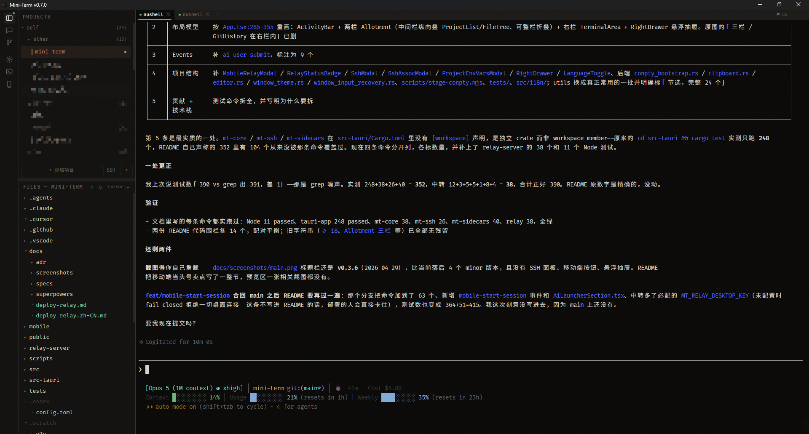
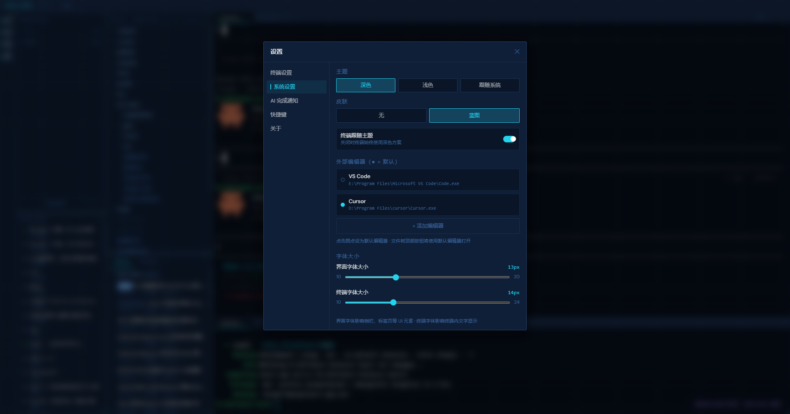
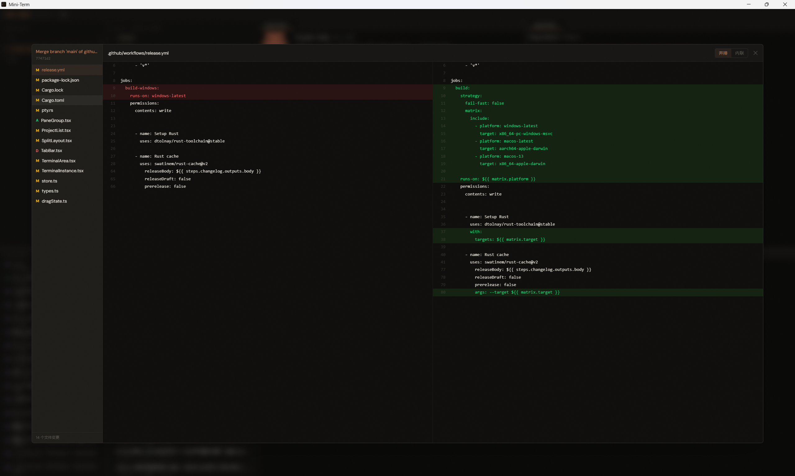

<p align="center">
  
</p>

<h1 align="center">Mini-Term</h1>

<p align="center">
  <strong>为 AI 时代打造的桌面终端管理器</strong><br>
  基于 Tauri v2 · 多项目 · 多标签 · 分屏布局 · AI 进程感知 · IM 平台远程驱动 (cc-connect)
</p>

<p align="center">
  <a href="README.md">English</a> · <strong>简体中文</strong>
</p>

<p align="center">
  
  
  
  
  
  
</p>

---

## 解决痛点

1. **重量级工具多余** — All In AI 的用户只需要终端跑 Agent，却不得不打开 VS Code / IDEA 等重型 IDE，大且占内存
2. **多 Agent 并发无感知** — 同时开多个 Claude / Codex 会话，某个 Agent 跑完了无法直观看到
3. **项目切换不便** — 系统终端缺少多项目组织、标签页和分屏管理能力

Mini-Term 用一个轻量桌面应用解决以上所有问题。

## 预览





## 功能特性

### 终端核心

- **多标签管理** — 每个项目独立标签页，拖拽排序，状态图标一目了然
- **递归分屏** — 横向 / 纵向任意嵌套分屏，Allotment 拖拽调整比例
- **高性能渲染** — xterm.js v6 + WebGL 加速，自动降级为 Canvas
- **10 万行滚动缓冲** — 拦截 CSI 3J（ED3）指令，Claude / Codex / OpenCode 等 TUI 清屏时保留上滚历史；拦截 alternate screen 切换，TUI 程序输出留在主缓冲区，滚动条和 scrollback 始终可用
- **终端缓存** — 切换项目 / 标签 / 分屏不重建 xterm 实例，已有内容不丢失；启动按需懒加载，仅当前可见 pane 创建 PTY，避免历史项目终端越多启动越卡
- **项目切换缓存** — FileTree / GitHistory 数据按项目缓存，切回已访问项目零延迟渲染；目录加载与 Git 状态并行执行，Git 仓库扫描结果缓存 30 秒
- **复制粘贴** — `Ctrl+Shift+C/V`（macOS `⌘+Shift+C/V`）快捷键 + 右键菜单，未选中时"复制"自动置灰；可在设置中开启「智能 `Ctrl+C/V`」（有选区时 `Ctrl+C` 复制、无选区时中断程序，`Ctrl+V` 直接粘贴）；Windows 大段多行粘贴自动分块写入，防止 ConPTY 丢行
- **长文本粘贴** — 剪贴板文本 ≥10 行或 ≥2000 字符时自动转存为临时 `.txt` 并粘贴带引号的文件路径，避免 AI 工具直接处理超长内容引发性能与 paste bracket 问题
- **图片粘贴** — 剪贴板含截图时自动检测，通过 Win32 API 保存为临时 PNG 并粘贴带引号的路径，兼容 PinPix 等非标准格式
- **文件拖拽** — 文件树或系统资源管理器拖文件到终端自动插入带引号的绝对路径，精准定位目标分屏 pane，兼容含空格的路径
- **多 Shell 配置** — Windows（cmd / powershell / pwsh）、macOS（zsh / bash）、Linux（bash / sh）等，可自由增删

### SSH 连接

- **连接管理** — 顶栏「SSH」按钮打开管理弹窗，对 SSH 连接增删改，支持主机 / 端口 / 用户名 / 密码 / 私钥 / 分组字段，持久化到配置文件
- **快速连接** — 终端内右键「SSH 连接」子菜单按分组列出已保存连接，选中后在当前终端直接拼接 `ssh` 命令拉起会话
- **密码自动填充** — 配了密码的连接，后端扫描 PTY 输出命中密码提示自动回写密码，每会话只填一次，密码错误时停止以防连灌错误密码
- **私钥权限自动处理** — 使用私钥连接时自动把密钥复制到权限收紧的临时副本（Windows `icacls` / Unix `0600`），绕过 OpenSSH「UNPROTECTED PRIVATE KEY FILE」拒绝，不修改用户原始密钥文件
- **进阶能力** — 密钥文件登录（`ssh -i`）、连接分组管理
- **SSH MCP Server** — 把已保存的 SSH 连接作为 MCP 工具暴露给终端里运行的 AI agent（Claude Code / Codex）。项目右键菜单「关联 SSH」勾选连接即按项目启用，并把可见范围限定在所选连接；内置 `mt-ssh-mcp` sidecar（基于官方 rmcp 的 stdio MCP server）提供 `ssh_list_connections`、`ssh_exec`、`ssh_upload`、`ssh_download` 四个工具，`ssh_exec` 复用密码 / 私钥认证，带超时、输出封顶与审计日志；`ssh_upload` / `ssh_download` 走 SFTP 单文件传输（分块流式、内存恒定，可传大文件，摆脱 `ssh_exec` + base64 echo 受输出封顶限制的 workaround），下载直接落盘到本地路径，并有一条硬护栏拒绝传输 mini-term 自身的 `config.json`（内含全部 SSH 明文凭据）；启用 / 停用时按命名 marker 幂等写入 Claude `.mcp.json` 与 Codex `.codex/config.toml`。**自 v0.4.10 起 sidecar 维护进程内 SSH 会话池**（russh 0.61 + tokio），首次调用某连接做一次 TCP 握手 + 认证（~秒级），后续命令仅消耗 RTT；会话空闲 10 分钟或最长 2 小时自动回收，并在 sidecar 退出时优雅 `disconnect`

### WSL 支持（Windows）

- **WSL 目录作为项目根** — 支持把 `\\wsl$\<distro>\<unix-path>` 与 `\\wsl.localhost\<distro>\<unix-path>` 两种形式的 WSL 路径添加为项目，前端展示路径自动剥掉 `\\?\UNC\` verbatim 前缀，文件树可正常展开与预览
- **自动 wsl.exe 启动** — 检测到 cwd 是 WSL UNC 路径时，`create_pty` 忽略用户配置的 shell（cmd / pwsh 等），强制改用 `wsl.exe -d <distro> --cd <unix-path>` 启动，cwd 真正落在 WSL 里（`pwd` 显示 `/home/<user>/proj` 而不是 `C:\Windows`），与 Windows Terminal `MangleStartingDirectoryForWSL` 行为一致；distro 名从路径直接 parse，不调 `wsl -l -v` 探测；触发重写时弹一次性 toast 提示
- **已知限制** — AI 进程识别（ai-working / ai-idle 状态）依赖宿主机的 `process_monitor` 看子进程名，wsl.exe 启动后 WSL VM 内的 `claude` / `codex` 进程不在监控范围内，AI 状态会失效；`notify` 文件监听在 WSL 9P 文件系统上事件大概率丢失，文件树需要手动刷新。仅 WSL2 验证，WSL1 兼容性未保证

### 文件搜索

- **全局搜索** — `Ctrl+Shift+F`（macOS `⌘+Shift+F`）快捷键或文件树工具栏按钮唤起，支持文件名搜索和文件内容搜索两种模式
- **正则匹配** — 可切换子串 / 正则模式，结果关键词高亮显示
- **流式推送** — 后端使用 ignore crate 遍历文件树，每 50 条或 100ms 批量推送结果，支持随时取消
- **内容分组** — 内容搜索模式按文件分组展示匹配行号，点击结果直接预览并定位到匹配行

### AI 进程感知

- **Hook 事件系统** — 接入 Claude Code / Codex 官方 Hook API，接收 AI 工具事件（SessionStart / End、ToolUse 等），比进程轮询更精准及时；内置 `miniterm-hook` CLI 工具供 Hook 系统调用，自动 POST 事件到本地服务器；设置界面一键注册 / 卸载 Hook 配置，合并而非覆盖用户已有 hook
- **实时状态检测** — Hook 优先 + 500ms 进程轮询降级，自动识别 Claude / Codex / OpenCode，显示 idle / working / error 状态
- **状态聚合** — 面板 → 标签页 → 项目逐层聚合，优先级 `error > ai-working > ai-idle > idle`
- **完成提醒三件套** — AI 任务从 working → idle 时立刻触发：
  - 右下角 Toast 桌面通知（仅非活跃项目弹出，同项目去重）
  - 项目列表 DONE 徽章，点击清除
  - 任务栏闪烁（Windows）/ Dock 跳动（macOS），窗口失焦时才触发
  - 提示音播放（Web Audio API 合成默认音，支持自定义音频文件）
  - 所有通知开关独立可配，设置中心单独「AI 完成通知」页面管理
- **会话进出检测** — 命令 echo 识别进入 AI；双击 `Ctrl+C` / `Ctrl+D` 或 `exit` / `quit` / `:quit` / `/logout` 识别退出
- **会话历史** — 读取本地 Claude / Codex 历史会话记录，右键复制恢复命令快速续接；首屏仅渲染 20 条，滚动到底部自动加载更多
- **会话查看** — 右键「查看」展示完整对话内容，User 纯文本 / Assistant Markdown 渲染（外链点击二次确认后调系统默认浏览器打开），支持 `Ctrl+F` 搜索高亮和 User 消息快速导航
- **WSL 会话** — Windows 下直接读取 WSL 发行版内的 Claude / Codex 历史会话（不 spawn `wsl.exe`，走 `\\wsl$` UNC + 注册表枚举发行版）：WSL 根项目自动推导发行版与路径零配置加载；Windows 路径项目右键「WSL 会话」子菜单选择发行版后按 `/mnt` 规则映射扫描，靠会话内 cwd 精确校验防串项目；WSL 会话与本机会话按时间混排并带 WSL 标识，加载中头部显示 spinner，查看正文同样支持
- **AI 任务标记** — AI 会话内每次用户按 Enter 自动在 xterm 打点，标签右上角 ⚑ 按钮下拉展示历史提交列表，点击或 `Ctrl+Shift+↑/↓`（macOS `⌘+Shift+↑/↓`）在标记间跳转，目标行短暂高亮提示

### cc-connect 集成

把本机跑的 AI agent 通过 IM 平台（飞书 / Slack / Telegram / Discord / 钉钉 / 微信等）远程驱动，与上游 [chenhg5/cc-connect](https://github.com/chenhg5/cc-connect) 桥接。入口统一收在顶栏「连接」按钮弹窗内。

- **进程管理（零配置）** — 「连接」弹窗内一键启动 / 停止 / 重启 / 测试连接 / 编辑 config.toml，可选 mini-term 启动时自动 spawn；可执行文件 / 配置路径留空时自动回退 PATH 中的 `cc-connect` 与 `~/.cc-connect/config.toml`，零配置即可使用；Windows 下按 PATH × PATHEXT 解析 npm 脚本壳（`.cmd` / `.ps1`），停止 / 重启用 `taskkill /T` 杀整棵进程树避免孤儿进程；关闭 mini-term 不联动 kill，保证 IM 持续可用
- **一键导入项目** — 「连接」弹窗内列出全部 mini-term 项目，勾选 / 全选后一键批量导入（用 `toml_edit` 追加 `[[projects]]` 保留注释、单次写盘 + 仅重启一次 cc-connect、同名冲突自动加 8 字符 hash 后缀），也可逐项单独导入；已导入项显示「● 已导入」并可一键移除。每个导入项目会附带一个**占位 Telegram 平台**（cc-connect 强制每个项目至少一个平台，否则冷启动失败），导入后到 Dashboard 把占位替换为真实 IM 平台即可启用
- **Dashboard 嵌入** — 「连接」弹窗内「打开 Dashboard」一键打开 cc-connect 自家 Web 控制台 iframe（自动登录态），直接在 mini-term 内配置 IM 平台 / 切换 provider / 管理 cron，无需另开浏览器；createPortal 到 `document.body` 绕开 Fluent 2 `[data-panel]` 的 backdrop-filter，确保全屏铺满；keep-alive 关闭走 `display:none` 不卸载，避免重新登录
- **半同步态处理** — 项目导入 / 移除即使 cc-connect 重启失败，前端按 `tomlWritten` / `deletedOk` 分支仍维持本地 `projectLinks`，warning toast 提示 restart 失败原因，下次启动 cc-connect 自动生效
- **优雅降级** — cc-connect 未运行时导入 / Dashboard 等按钮置灰提示「先启动 cc-connect」而非崩溃；config.toml 未配置 `[management].token` 时给出友好诊断指引用户跑 `cc-connect web` 自动生成

### 项目管理

- **项目列表** — 左侧边栏管理多个项目目录，一键切换工作区，重启自动恢复上次激活项目
- **拖拽添加项目** — 从资源管理器拖拽文件夹到项目列表即可快速添加，自动识别文件 / 文件夹 / 重复项目并给出视觉反馈
- **嵌套分组** — 最多 3 级项目分组，拖拽排序，折叠 / 展开，分组右键菜单可直接添加项目并归入该组
- **文件树** — 集成目录浏览器，自然排序（V1 → V2 → V10 而非字典序），嵌套 `.gitignore` 置灰（每层子目录的忽略规则与 `!pattern` 白名单都会生效，与 git 行为一致），`notify` 文件监听实时刷新
- **文件操作** — 文件树内新建文件 / 文件夹、重命名、删除、查看内容（Markdown 渲染支持 HTML 标签和外部图片，外链点击二次确认后调系统默认浏览器打开，图片格式直接展示，HTML 文件 iframe 预览并自动解析相对路径资源，二进制与超大文件友好提示）
- **外部编辑器打开** — 文件树右上角按钮一键用配置的编辑器（默认 VS Code）打开当前项目，路径可在「设置 → 系统设置 → 外部编辑器」自定义；文件可用系统默认应用打开
- **项目级环境变量** — 项目右键菜单「环境变量…」打开管理弹窗，行级 `[启用 checkbox][key][value][✕]` 布局，启动该项目终端时按项目注入到 PTY 子进程；严格 POSIX 校验（key 匹配 `^[A-Za-z_][A-Za-z0-9_]*$`、非 `MINITERM_` 前缀、不可用 `WSLENV`、项目内不重复，value 禁 `\n/\r/\0`）；Rust 端再加 `MINITERM_` 前缀 + `WSLENV` 防御性过滤，即便手改 `config.json` 绕过前端校验也无法破坏 hook 协议或 WSLENV 拼接；WSL 项目下环境变量通过 WSLENV 机制透传至 Linux bash（`/u` 单向不做路径翻译；`~/.bashrc` 中 `export` 同名变量会覆盖）

### Git 集成

- **文件状态** — 文件树显示 Git 状态颜色（修改 / 新增 / 删除 / 冲突）
- **变更 Diff** — 工作区文件变更的详细 Diff，Hunk 行级解析，并排 / 内联双视图，并排模式支持拖拽调节分隔比例，字号跟随终端字体设置
- **提交历史** — 浏览仓库提交记录，游标分页加载（默认 30 条）
- **提交 Diff** — 查看任意提交的文件变更，逐文件切换
- **分支信息** — 本地 / 远程分支列表
- **源码控制面板** — VS Code 风格 Changes 面板，Staged / Changes / Untracked 分组展示，支持单文件和全量 stage / unstage / discard，`Ctrl+Enter` 快速提交，列表与树形视图切换
- **Pull / Push** — 仓库行内按钮一键同步远端，支持刷新按钮重新加载提交记录与分支信息
- **多仓库发现** — 自动扫描项目目录下所有 Git 仓库（递归 5 层，跳过 `node_modules` 等）



### 外观与配置

- **Activity Bar 侧边栏** — 最左侧常驻 40px 图标栏，含 Projects / Sessions / Files / Git 四个面板开关，独立控制显隐，激活态蓝色竖条指示，状态持久化
- **三种主题模式** — Auto（跟随系统）/ Light / Dark，深色基于 Warm Carbon 暖炭色调，自定义 CSS 变量体系；Windows 原生标题栏（DWM Immersive Dark Mode）自动跟随主题切换，启动深色用户无首帧浅色闪烁
- **Blueprint 蓝图皮肤** — 可选科幻风蓝图皮肤，网格背景 + 角标记 + 光晕效果，支持深色 / 日间两种模式，终端配色同步切换
- **字体独立调节** — UI 与终端的字号（10-20px）/ 字体 family 分别可调，终端可选是否跟随 UI 主题
- **连体字 (ligatures)** — 终端连体字渲染开关，开启后 `==` `=>` `!=` `->` 等合成 ligature glyph，需字体含 calt 表（Fira Code / JetBrains Mono）；Windows 完整支持，macOS / Linux 受 webview API 限制使用 60 条 Iosevka fallback
- **布局持久化** — 分屏比例、标签页、窗口大小 / 位置自动保存，重启恢复（`tauri-plugin-window-state`）
- **关闭确认** — 关闭窗口前二次确认，并 flush 所有项目布局，避免误操作
- **版本检查** — 启动时拉取 GitHub Release，标题栏显示新版本提示
- **中英双语界面** — 「设置 → 系统」一键切换中 / 英文，整个界面实时重渲染；首次启动按系统语言自动探测并记忆选择，重启保留。每个页面、每个功能的文案均已翻译，内置轻量 i18n 层（无额外运行时依赖）
- **设置中心** — 统一的 SettingsModal 管理主题、字体、Shell、AI 通知等所有开关

## 技术栈

| 层 | 技术 |
|---|---|
| 框架 | Tauri v2（Rust 后端 + WebView 前端） |
| 前端 | React 19 + TypeScript 5.8 + Tailwind CSS v4 + Vite 7 |
| 终端 | xterm.js v6（WebGL addon，Canvas 降级） |
| 状态 | Zustand（全局单一 Store） |
| 布局 | Allotment（三栏主布局 + 递归 SplitNode 分屏树） |
| PTY | portable-pty 0.8 |
| Git | git2 0.19 |
| 文件监听 | notify 7 + ignore 0.4（.gitignore 过滤） |
| Tauri 插件 | `window-state` · `clipboard-manager` · `dialog` · `opener` |
| 测试覆盖 | 155 个 Rust 单元测试（pty / fs / config / hook / cc-connect） |

## 快速开始

### 直接下载

前往 [Releases](https://github.com/dreamlonglll/mini-term/releases) 页面下载最新安装包。

> **平台支持说明**
> - **Windows** — 主要支持平台，保证可用性，日常开发与测试均在 Windows 上进行
> - **macOS / Linux** — 代码层面已支持（Tauri bundle targets = `all`），但**可用性欠佳**，未经充分打磨，欢迎提 Issue 反馈

#### macOS 安装提示

下载 `.dmg` 后双击打开,如果系统弹出 **"Mini-Term" is damaged and can't be opened. You should move it to the Bin**(已损坏,移到废纸篓),这并不是文件真的损坏 —— 而是 Release 产物没有 Apple Developer ID 签名,被 Gatekeeper 因 quarantine 标记拒绝。

把 `.app` 拖入 `/Applications` 后,在终端执行一次即可解除限制:

```bash
xattr -cr /Applications/Mini-Term.app
```

之后正常双击启动。每次升级新版本都需要再执行一次。

### 从源码构建

#### 前置条件

- [Node.js](https://nodejs.org/) >= 18
- [Rust](https://www.rust-lang.org/tools/install) >= 1.70
- [Tauri v2 CLI](https://v2.tauri.app/start/prerequisites/)

#### 安装与运行

```bash
# 克隆仓库
git clone https://github.com/dreamlonglll/mini-term.git
cd mini-term

# 安装依赖
npm install

# 启动完整 Tauri 开发环境（前端 + 后端）
npm run tauri dev

# 构建发布包
npm run tauri build
```

## 项目结构

```
mini-term/
├── src/                          # 前端源码
│   ├── App.tsx                   # 三栏主布局入口 + 窗口事件
│   ├── store.ts                  # Zustand 全局状态 + 持久化
│   ├── types.ts                  # 类型定义（Pane / Tab / Project / SplitNode ...）
│   ├── styles.css                # 全局样式 + CSS 变量（Warm Carbon）
│   ├── components/
│   │   ├── ProjectList.tsx       # 项目列表 + 嵌套分组 + DONE 徽章
│   │   ├── SessionList.tsx       # AI 会话历史列表（Claude / Codex）
│   │   ├── FileTree.tsx          # 文件目录树 + Git 状态 + 新建 / 重命名
│   │   ├── TerminalArea.tsx      # 标签管理 + 分屏树操作
│   │   ├── SplitLayout.tsx       # 递归渲染 SplitNode 分屏树
│   │   ├── TerminalInstance.tsx  # xterm.js 实例 + 右键菜单 + 文件拖拽
│   │   ├── PaneGroup.tsx         # 分屏分组容器
│   │   ├── MarkerList.tsx        # AI 任务标记下拉列表
│   │   ├── GitHistory.tsx        # Git 仓库树 + 提交历史 + Pull / Push
│   │   ├── GitHistoryContent.tsx # Git 提交历史内容渲染
│   │   ├── GitChanges.tsx        # 源码控制面板（stage / unstage / commit）
│   │   ├── CommitDiffModal.tsx   # 提交 Diff 查看器
│   │   ├── DiffModal.tsx         # 工作区文件 Diff 查看器
│   │   ├── SearchModal.tsx       # 全局文件搜索弹窗
│   │   ├── FileViewerModal.tsx   # 文件内容查看器
│   │   ├── SessionViewerModal.tsx # AI 会话内容查看器（Markdown 渲染）
│   │   ├── SettingsModal.tsx     # 设置弹窗（主题 / 字体 / Shell / AI 通知 / Hook）
│   │   ├── ToastContainer.tsx    # AI 完成 Toast 通知
│   │   ├── ActivityBar.tsx       # Activity Bar 侧边栏（面板显隐 + AI 状态角标）
│   │   ├── DoneTag.tsx           # 项目列表 DONE 徽章
│   │   └── StatusDot.tsx         # 状态指示点
│   ├── hooks/
│   │   ├── useTauriEvent.ts      # Tauri 事件订阅封装
│   │   ├── useAiSubmitMarker.ts  # AI 会话 Enter 打点
│   │   ├── useExternalFileDrop.ts # 系统资源管理器拖拽文件到终端
│   │   └── useMarkerHotkeys.ts   # 标记间跳转快捷键
│   └── utils/
│       ├── contextMenu.ts        # 右键菜单 DOM 实现
│       ├── dragState.ts          # 项目树拖拽状态
│       ├── fileDragState.ts      # 文件拖拽到终端状态管理
│       ├── projectTree.ts        # 项目树递归操作
│       ├── terminalCache.ts      # xterm 缓存 + 复制粘贴
│       ├── projectDataCache.ts   # FileTree / GitHistory 项目级数据缓存
│       ├── themeManager.ts       # 主题切换 + 系统配色监听
│       └── updateChecker.ts      # GitHub Release 版本检查
├── src-tauri/                    # Rust 后端（Tauri 应用 + 共享 crate + sidecar）
│   ├── src/
│   │   ├── lib.rs                # Tauri 初始化与命令 / 插件注册
│   │   ├── pty.rs                # PTY 生命周期 + AI 会话识别
│   │   ├── process_monitor.rs    # 子进程状态轮询（500ms）+ Hook 优先
│   │   ├── config.rs             # 配置持久化 + 版本迁移
│   │   ├── fs.rs                 # 目录列表 / 监听 / 新建 / 重命名 / 删除
│   │   ├── git.rs                # Git 操作（状态 / Diff / Log / Pull / Push）
│   │   ├── search.rs             # 全局文件搜索（文件名 + 内容，流式推送）
│   │   ├── ai_sessions.rs        # Claude / Codex 会话记录读取（本机 + WSL UNC）
│   │   ├── wsl_distros.rs        # WSL 发行版枚举（读注册表 Lxss，不 spawn wsl.exe）
│   │   ├── hook_server.rs        # Hook HTTP 服务器（接收 AI 工具事件）
│   │   ├── hook_registry.rs      # Hook 注册 / 卸载（Claude Code + Codex）
│   │   ├── ssh.rs                # SSH 连接管理 + 密码自动填充 / 私钥处理
│   │   └── ssh_mcp_registry.rs   # 按项目启用 SSH MCP（写入 .mcp.json / Codex 配置）
│   ├── mt-core/                  # 无 tauri 依赖的共享库 crate（SSH 类型 / 配置 / 私钥）
│   └── mt-sidecars/src/bin/      # 独立 sidecar crate（不依赖 tauri-build）
│       ├── miniterm-hook.rs      # Hook CLI 小工具（被 AI 工具 hook 调用）
│       └── mt-ssh-mcp.rs         # SSH MCP server（rmcp stdio，供终端 AI agent 调用）
├── scripts/
│   └── stage-sidecars.mjs        # 构建 sidecar 并按 triple 就位为 Tauri externalBin
└── package.json
```

## 架构概览

### 数据流

```
用户键入 → xterm.onData → invoke('write_pty') → Rust PTY writer
Rust PTY reader → 16ms 批量缓冲 → emit('pty-output') → term.write()
进程退出       → emit('pty-exit')          → store.updatePaneStatusByPty('error')
进程监控 500ms → emit('pty-status-change') → StatusDot 更新
文件变更 notify → emit('fs-change')         → FileTree 刷新
ai-working → ai-idle → Toast + DONE Tag + requestUserAttention
```

### Tauri 接口一览

- **Commands（61 个）** — PTY: `create_pty` · `write_pty` · `resize_pty` · `kill_pty`；FS: `list_directory` · `read_file_content` · `watch_directory` · `unwatch_directory` · `create_file` · `create_directory` · `rename_entry` · `delete_entry` · `filter_directories`；Search: `start_search` · `cancel_search`；Git: `get_git_status` · `get_git_diff` · `discover_git_repos` · `get_git_log` · `get_repo_branches` · `get_commit_files` · `get_commit_file_diff` · `git_pull` · `git_push` · `get_changes_status` · `git_stage` · `git_unstage` · `git_stage_all` · `git_unstage_all` · `git_commit` · `git_discard_file`；Config: `load_config` · `save_config`；Editor: `open_in_editor` · `open_path_with_default_app`；Clipboard: `read_clipboard_image` · `save_clipboard_text`；AI: `get_ai_sessions` · `get_wsl_ai_sessions` · `get_ai_session_content`；WSL: `list_wsl_distros`；Hook: `register_ai_hooks` · `unregister_ai_hooks` · `get_hook_config_snippet` · `get_hook_status` · `toggle_hook_server`；SSH: `arm_ssh_autofill` · `prepare_ssh_key`；SSH MCP: `enable_ssh_mcp` · `disable_ssh_mcp`；主题: `set_window_dark_mode`；cc-connect: `cc_connect_probe` · `cc_connect_read_token` · `cc_connect_config_path` · `cc_connect_start` · `cc_connect_stop` · `cc_connect_restart` · `cc_connect_list_projects` · `cc_connect_import_project` · `cc_connect_import_projects` · `cc_connect_unlink_project`
- **Events（后端 → 前端）** — `pty-output` · `pty-exit` · `pty-status-change` · `fs-change` · `search-results` · `search-complete`

### 状态优先级

终端面板状态从叶节点聚合到标签页和项目级别：

```
error > ai-working > ai-idle > idle
```

### 布局模型

```
App
├── ActivityBar（常驻最左侧，面板显隐开关 + AI 状态角标）
├── Allotment 三栏
│   ├── 左栏：ProjectList（项目 + 分组 + 会话 + DONE 徽章）
│   ├── 中栏：FileTree（目录浏览 + Git 状态 + 文件操作）
│   └── 右栏
    ├── TabBar（标签管理）
    ├── SplitLayout（递归 SplitNode 分屏树）
    │   └── TerminalInstance × N（xterm.js + 右键菜单）
    └── GitHistory（仓库树 + 提交历史 + Pull/Push）

ToastContainer 悬浮于右下角，SettingsModal 覆盖全局。
```

## 推荐开发环境

- [VS Code](https://code.visualstudio.com/) + [Tauri](https://marketplace.visualstudio.com/items?itemName=tauri-apps.tauri-vscode) + [rust-analyzer](https://marketplace.visualstudio.com/items?itemName=rust-lang.rust-analyzer)

## 贡献

欢迎提交 Issue 和 PR。外部贡献会经过功能验证和安全审查后合并。

提交代码前请运行：

```bash
# 前端类型检查
npm run build

# Rust 测试与构建
cd src-tauri && cargo test && cargo build
```

## 社区

学 AI，上 L 站 — [LinuxDO](https://linux.do/)
